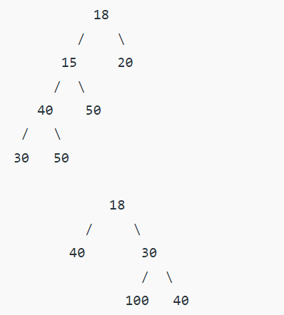
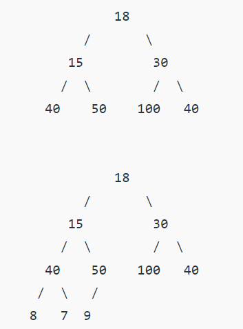
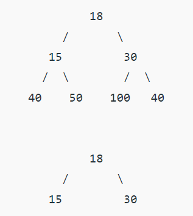
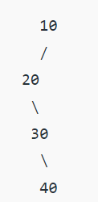

### Binary Tree
#### properties
1. The maximum number of nodes at **level** ‘l’ of a binary tree is **2l** (Level of the root is 0). 
2. The Maximum number of nodes in a binary tree of **height** ‘h’ is **2h – 1**. 
3. In a Binary Tree with N **nodes**, minimum possible **height** or the minimum number of levels is **Log2(N+1)**.
4. A Binary Tree with L **leaves** has at least **| Log2L |+ 1**   levels. 
5. In Binary tree where every node has 0 or 2 children, the number of **leaf nodes** is always one more than **nodes with two children**.

####  types of Binary Trees
1. **Full Binary Tree** : A Binary Tree is a full binary tree if every node has 0 or 2 children.

2. **Complete Binary Tree** : A Binary Tree is a Complete Binary Tree if all the levels are completely filled except possibly the last level and the last level has all keys as left as possible.

3. **Perfect Binary Tree** : A Binary tree is a Perfect Binary Tree in which all the internal nodes have two children and all leaf nodes are at the same level. 

    In a Perfect Binary Tree, the number of leaf nodes is the number of internal nodes plus 1   
    **L = I + 1 Where L = Number of leaf nodes, I = Number of internal nodes**.
    A Perfect Binary Tree of height **h** (where the height of the binary tree is **the number of edges** in the longest path from the root node to any leaf node in the tree, height of root node is 0) has 2h+1 – 1 node.
    一个深度为k(>=-1)且有2^(k+1) - 1个结点的二叉树称为完美二叉树

4. **Balanced Binary Tree** :  if the height of the tree is O(Log n) where n is the number of nodes.
5. **A degenerate (or pathological) tree** A Tree where every internal node has one child. Such trees are performance-wise same as linked list. 
   

#### Tree Traversals (Inorder, Preorder and Postorder)

Depth First Traversals: 
(a) Inorder (Left, Root, Right) : 4 2 5 1 3 
(b) Preorder (Root, Left, Right) : 1 2 4 5 3 
(c) Postorder (Left, Right, Root) : 4 5 2 3 1
Breadth-First or Level Order Traversal: 1 2 3 4 5 
- Time Complexity: O(n) 
- T(n) = T(k) + T(n – k – 1) + c
    - k is **the number of nodes** on one side of the root
    - n-k-1 on the other side.
#### Inorder Tree Traversal without Recursion
1) Create an empty stack S.
2) Initialize current node as root
3) Push the current node to S and set current = current->left until current is NULL
4) If current is NULL and stack is not empty then 
     a) Pop the top item from stack.
     b) Print the popped item, set current = popped_item->right 
     c) Go to step 3.
5) If current is NULL and stack is empty then we are done.

