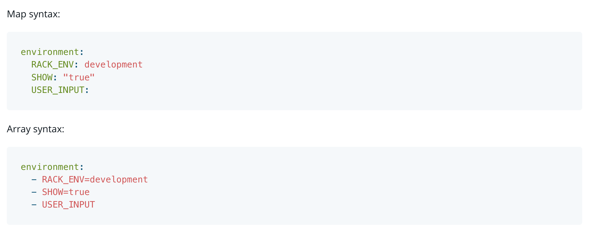

`Docker Compose` is a tool that was developed to help **define** and **share** multi-container applications. 

The Compose file is a **`YAML`** file defining version (DEPRECATED), services (REQUIRED), networks, volumes, configs and secrets. The default path for a Compose file is **`compose.yaml`** (preferred) or **`compose.yml`** in working directory. Compose implementations SHOULD also support docker-compose.yaml and docker-compose.yml for backward compatibility. If both files exist, Compose implementations MUST prefer canonical compose.yaml one.

### network_mode
`network_mode` set service containers network mode. Available values are platform specific, but Compose specification define specific values which MUST be implemented as described if supported:
- `none` which disable all container networking
- `host` which gives the container raw access to host’s network interface
- `service:{name}` which gives the containers access to the specified service only
`network_mode: "host"`
`network_mode: "none"`
`network_mode: "service:[service name]"`

### image
`image` specifies the image to start the container from. Image MUST follow the Open Container Specification addressable image format, as `[<registry>/][<project>/]<image>[:<tag>|@<digest>]`.

    image: redis
    image: redis:5
    image: redis@sha256:0ed5d5928d4737458944eb604cc8509e245c3e19d02ad83935398bc4b991aac7
    image: library/redis
    image: docker.io/library/redis
    image: my_private.registry:5000/redis

### environment
`environment` defines environment variables set in the container. `environment` can use either an array or a map. Any boolean values; true, false, yes, no, SHOULD be enclosed in quotes to ensure they are not converted to True or False by the YAML parser.
Environment variables MAY be declared by a single key (no value to equals sign). In such a case Compose implementations SHOULD rely on some user interaction to resolve the value. If they do not, the variable is unset and will be removed from the service container environment.

### command
`command` overrides the the default command declared by the container image (i.e. by Dockerfile’s CMD).Two form:
`command: bundle exec thin -p 3000`
`command: [ "bundle", "exec", "thin", "-p", "3000" ]`

