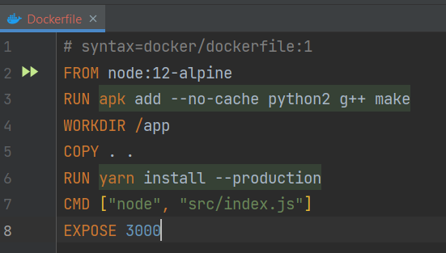
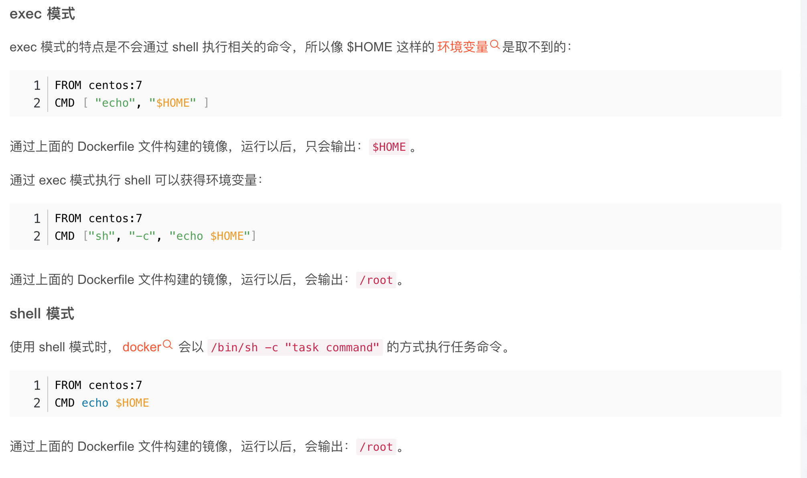

- `FROM` : make basic image.FROM is a **required** command and must be the **first** command.
- `RUN` : Used to execute command line commands.There are two formats:
  -  shell format: `RUN <command>`
  -  exec format: `RUN ["executable", "parameter 1", "parameter 2"]`
    The default permission for the **run** command is **sudo**, which adds a **new layer** to the docker **each time** run is executed.
- `COPY` : The `COPY` instruction copies new files or directories from `<src>` and adds them to **the filesystem of the container** at the path `<dest>`.
- `ADD` : The `ADD` instruction copies new files, directories or remote file URLs from `<src>` and adds them to **the filesystem of the image** at the path `<dest>`.
  - `<src>` can be a URL
  - if `<src` is `.tar` file.The `ADD` instruction will automatically decompress the zip file to the `<dest>`.
- !!! Therefore, when choosing between the COPY and ADD instructions, you can follow the principle of using the COPY instruction for all file copying and ADD only when automatic decompression is required.

- `CMD` : The CMD instruction has three forms:

  - CMD ["executable","param1","param2"] (exec form, this is the **preferred form**)
  - CMD ["param1","param2"] (as default parameters to ENTRYPOINT)
  - CMD command param1 param2 (shell form)
  There can only be **one** CMD instruction in a Dockerfile.
  - The command that follows the image name replaces the CMD default when run.
**The main purpose of a CMD is to provide defaults for an executing container**.

- `ENTRYPOINT` ： configure a container that will run as an executable.
    - The purpose of ENTRYPOINT is the **same** as CMD, to specify the container launcher and its parameters
    - `docker run <image> -d` will pass the ***-d*** argument to the *entry point*.
    - When `ENTRYPOINT` is specified, the meaning of the `CMD` changes, instead of running its command directly, the contents of the `CMD`are passed as an argument to the `ENTRYPOINT` command, in other words when actually executed, it will become
    `<ENTRYPOINT> "<CMD>"`

- `ENV` : The ENV instruction sets the environment variable `<key>` to the value `<value>`. 
  - two form:
    - `ENV <key> <value>`
    - `ENV <key1>=<value1> <key2>=<value2>...`
  - Once the environment variable is defined, it can then be used in subsequent commands.(like `RUN`)

- `EXPOSE` : `EXPOSE <port> [<port>/<protocol>...]`
  - instruction informs Docker that the container listens on the specified network ports at runtime.
  - The `EXPOSE` instruction does not actually publish the port.

- `WORKDIR` : The `WORKDIR` instruction sets the working directory for any `RUN`, `CMD`, `ENTRYPOINT`, `COPY` and `ADD` instructions that follow it in the Dockerfile.