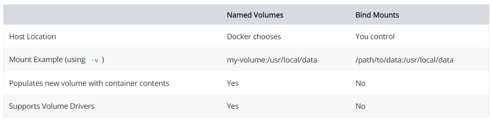

### Docker

#### Container
- is a runnable instance of an image. You can create, start, stop, move, or delete a container using the DockerAPI or CLI.
- can be run on local machines, virtual machines or deployed to the cloud.
- is portable (can be run on any OS)
- Containers are isolated from each other and run their own software, binaries, and configurations.

#### Image
- When running a container, it uses an **isolated filesystem**. This custom filesystem is provided by a container **image**.
- it must contain everything needed to run an application - all dependencies, configuration, scripts, binaries, etc.
- The image also contains other configuration for the container, such as environment variables, a default command to run, and other metadata.

#### Docker Registry
- 一个集中的存储、分发镜像的服务。
- 一个 Docker Registry 中可以包含多个 仓库（Repository）；每个仓库可以包含多个 标签（Tag）；每个标签对应一个镜像。
- 我们可以通过 <仓库名>:<标签> 的格式来指定具体是这个软件哪个版本的镜像。如果不给出标签，将以 latest 作为默认标签。

### User Images

#### Build the app’s container image
1. Create a file named `Dockerfile`
2. build the container image using the `docker build` command.
   - `docker build -t getting-started .`
   - used the Dockerfile to build a new container image
   -  the `-t` flag tags our image. Think of this simply as a human-readable name for the final image

#### Start an app container
1. `docker run`: Start your container
2.  `docker run -dp 3000:3000 getting-started`
      - `d` - run the container in detached mode (in the background)
      - `p` (hostPort)3000:(containerPort)3000 - map port 3000 of the host to port 3000 in the container

#### Remove a container using the CLI
1. Get the ID of the container by using the docker ps command.
`docker ps`
2. Use the docker stop command to stop the container.
`docker stop <the-container-id>`
3. Once the container has stopped, you can remove it by using the docker rm command.
`docker rm <the-container-id>`

#### Share the application

#### Push the image
1. `docker image ls` : list the image on your computer
   
      
2. `docker login -u YOUR-USER-NAME` : Login to the Docker Hub using the command
   
3. Use the `docker tag` command to give the getting-started image a new name. Be sure to swap out YOUR-USER-NAME with your Docker ID
   `docker tag getting-started YOUR-USER-NAME/getting-started`
   
4. `docker push YOUR-USER-NAME/getting-started` : push image to Docker Hub
   
   

### Persist the DB    Volumes
 Each container starts from the image definition each time it starts.
 All changes are **lost** when the container is removed
 **Volumes** provide the ability to connect specific filesystem paths of the container back to the host machine.

#### Named Volume
1. Create a volume by using the `docker volume create` command.
   `docker volume create todo-db`
2. Start the todo app container, but add the **-v** flag to specify a volume mount. We will use the named volume and mount it to /etc/todos, which will capture all files created at the path.
   `docker run -dp 3000:3000 -v todo-db:/etc/todos getting-started`
3. check where is docker storing data of named volume
   `docker volume inspect todo-db`

#### Bind Mounts
Start a dev-mode container
To run our container to support a development workflow, we will do the following:
- Mount our source code into the container
- Install all dependencies, including the “dev” dependencies
- Start nodemon to watch for filesystem changes
`docker run -dp 3000:3000 `
     `-w /app -v "$(pwd):/app" `
     `node:12-alpine `
     `sh -c "yarn install && yarn run dev"`
- -dp 3000:3000 - same as before. Run in detached (background) mode and create a port mapping
- -w /app - sets the “working directory” or the current directory that the command will run from
- -v "$(pwd):/app" - bind mount the current directory from the host in the container into the /app directory
node:12-alpine - the image to use. Note that this is the base image for our app from the Dockerfile
- sh -c "yarn install && yarn run dev" - the command. We’re starting a shell using sh (alpine doesn’t have bash) and running yarn install to install all dependencies and then running yarn run dev. If we look in the package.json, we’ll see that the dev script is starting nodemon.

### Multi container apps
#### Start MySQL
There are two ways to put a container on a network: 
  1) Assign it at start or 
  2) connect an existing container.

- Create the network.
  `docker network create todo-app`
- Start a MySQL container and attach it to the network.
  `docker run -d \`
     `--network todo-app --network-alias mysql \`
     `-v todo-mysql-data:/var/lib/mysql \`
     `-e MYSQL_ROOT_PASSWORD=secret \`
     `-e MYSQL_DATABASE=todos \`
     `mysql:5.7`

