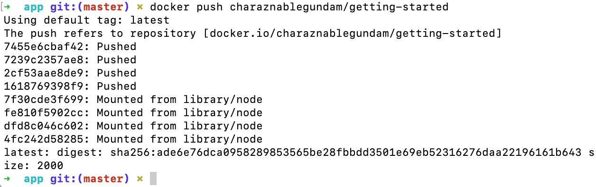

### Docker

#### Container
- is a runnable instance of an image. You can create, start, stop, move, or delete a container using the DockerAPI or CLI.
- can be run on local machines, virtual machines or deployed to the cloud.
- is portable (can be run on any OS)
- Containers are isolated from each other and run their own software, binaries, and configurations.

#### Image
- When running a container, it uses an **isolated filesystem**. This custom filesystem is provided by a container **image**.
- it must contain everything needed to run an application - all dependencies, configuration, scripts, binaries, etc.
- The image also contains other configuration for the container, such as environment variables, a default command to run, and other metadata.

#### Docker Registry
- 一个集中的存储、分发镜像的服务。
- 一个 Docker Registry 中可以包含多个 仓库（Repository）；每个仓库可以包含多个 标签（Tag）；每个标签对应一个镜像。
- 我们可以通过 <仓库名>:<标签> 的格式来指定具体是这个软件哪个版本的镜像。如果不给出标签，将以 latest 作为默认标签。

### User Images

#### Build the app’s container image
1. Create a file named `Dockerfile`
2. build the container image using the `docker build` command.
   - `docker build -t getting-started .`
   - used the Dockerfile to build a new container image
   -  the `-t` flag tags our image. Think of this simply as a human-readable name for the final image

#### Start an app container
1. `docker run`: Start your container
2.  `docker run -dp 3000:3000 getting-started`
      - `d` - run the container in detached mode (in the background)
      - `p` (hostPort)3000:(containerPort)3000 - map port 3000 of the host to port 3000 in the container

#### Remove a container using the CLI
1. Get the ID of the container by using the docker ps command.
`docker ps`
2. Use the docker stop command to stop the container.
`docker stop <the-container-id>`
3. Once the container has stopped, you can remove it by using the docker rm command.
`docker rm <the-container-id>`

#### Share the application

#### Push the image
1. `docker image ls` : list the image on your computer
   
      
2. `docker login -u YOUR-USER-NAME` : Login to the Docker Hub using the command

      
3. Use the `docker tag` command to give the getting-started image a new name. Be sure to swap out YOUR-USER-NAME with your Docker ID
   `docker tag getting-started YOUR-USER-NAME/getting-started`
   
4. `docker push YOUR-USER-NAME/getting-started` : push image to Docker Hub
   
   