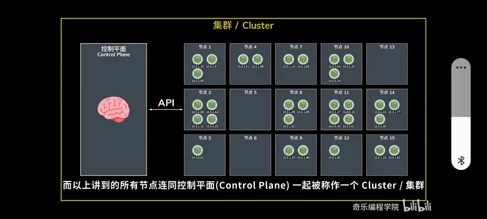
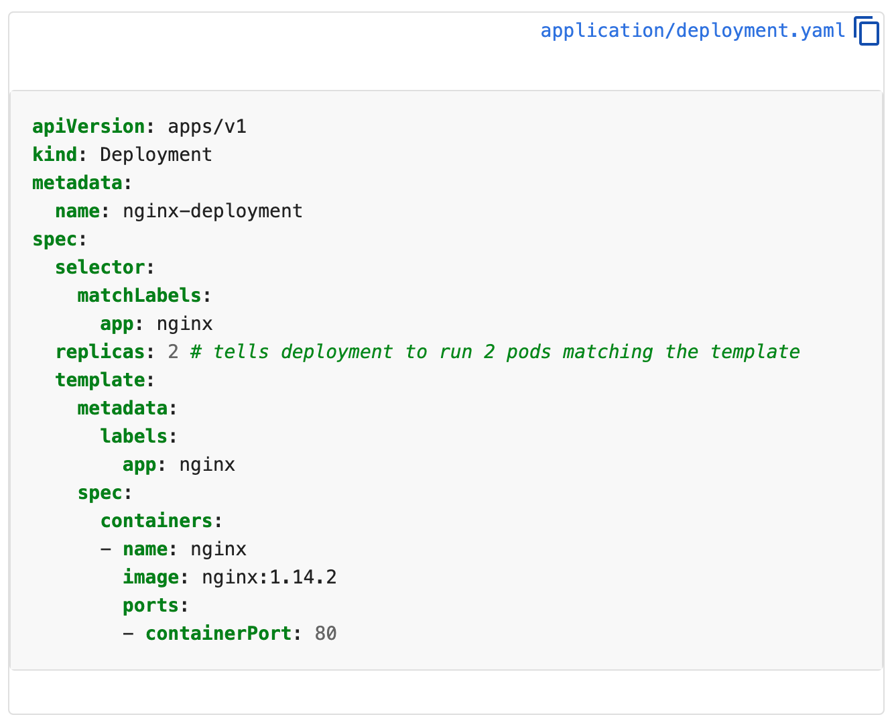

### Tutorial
#### kubectl 
The Kubernetes command-line tool, `kubectl`, allows you to run commands against Kubernetes clusters. You can use kubectl to deploy applications, inspect and manage cluster resources, and view logs. 
#### kind
`kind` lets you run Kubernetes on your local computer. This tool requires that you have Docker installed and configured.
#### minikube
Like `kind`, `minikube` is a tool that lets you run Kubernetes locally. minikube runs a single-node Kubernetes cluster on your personal computer (including Windows, macOS and Linux PCs) so that you can try out Kubernetes, or for daily development work.

A Kubernetes `cluster` consists of a set of worker machines, called `nodes`.
A `Node` consists of a set of `pods`.
A `pod` consists of a set of `containers`.
`Control Plane` talk to Node by API

### yaml

- `apiVersion` - Which version of the Kubernetes API you're using to create this object
- `kind` - What kind of object you want to create
- `metadata` - Data that helps uniquely identify the object, including a `name` string, `UID`, and optional `namespace`
- `spec` - What state you desire for the object

**The precise format of the object spec is different for** **every Kubernetes object, and contains nested fields** **specific to that object.**

### Pods
Pods are the **smallest deployable units** of computing that you can create and manage in Kubernetes.

A Pod is a **group** of one or more **containers**, with shared storage and network resources, and a specification for how to run the containers. 

In terms of **Docker concepts**, a Pod is similar to **a group of Docker containers** with shared **namespaces** and shared **filesystem volumes**.

You can use **workload resources** to create and manage multiple Pods.
Here are some examples of workload resources that manage one or more Pods:
  - Deployment : Manages a replicated application on cluster.
  - StatefulSet : Manages deployment and scalling of a set of Pods,with durable stroage and persistent identifiers for each Pod.
  - DaemonSet : Ensures a copy of pod is running across a set of nodes in a cluster

