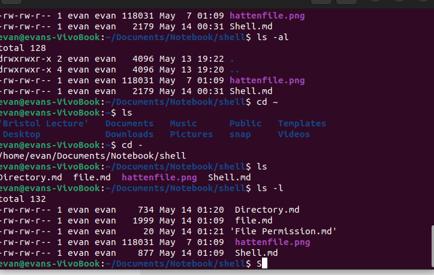
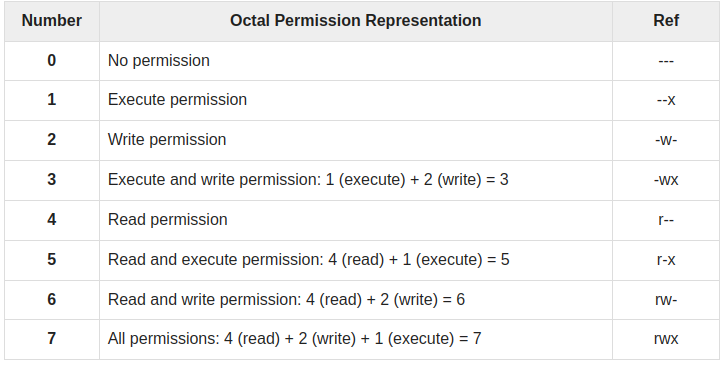

### File Permission

#### Changing Permissions
- `chmod o+wx testfile`: **+** Adds the designated permission(s) to a file or directory.
- `chmod u-x testfile` : **-** Removes the designated permission(s) from a file or directory.

#### Using chmod with Absolute Permissions

- `chmod 755 testfile`
- `chmod 743 testfile`
- `chmod 043 testfile`

#### Changing Owners and Groups
- `chown user filelist`: **chown** − The chown command stands for "change owner" and is used to change the owner of a file.
- `chgrp group filelist`: **chgrp** − The chgrp command stands for "change group" and is used to change the group of a file.

#### SUID and SGID File Permission
As an example, when you change your password with the passwd command, your new password is stored in the file /etc/shadow.

As a regular user, you do not have read or write access to this file for security reasons, but when you change your password, you need to have the write permission to this file. This means that the passwd program has to give you additional permissions so that you can write to the file /etc/shadow.

Additional permissions are given to programs via a mechanism known as the ***Set User ID (SUID)*** and ***Set Group ID (SGID)*** bits.

- Set User ID (SUID) : run as program owner
- Set Group ID (SGID) : run as group owner of program

The SUID and SGID bits will appear as the letter "**s**" if the permission is available.

**If the sticky bit is enabled on the directory, files can only be removed if you are one of the following users −**
- The owner of the sticky directory
- The owner of the file being removed
- The super user, root

