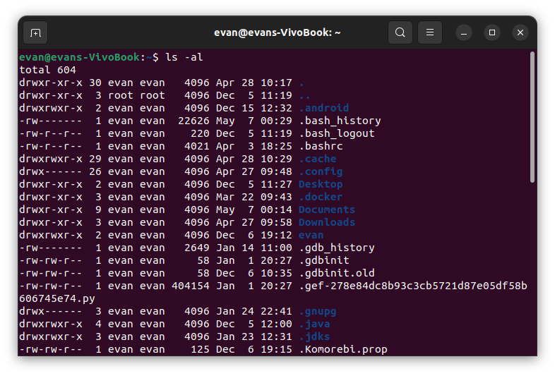

## What is Unix
- The Unix operating system is a **set of programs** that act as a link between the computer and the user.
- The computer programs that allocate the system resources and coordinate all the details of the computer's internals is called the **operating system** or the **kernel**.
- Users communicate with the kernel through a program known as the **shell**.
- The shell is a **command line interpreter**.

## Command
### normal-1
- `cal`: check the calender
- `passwd`: change password
- `whoami`: show the current user
- `who`+`users`+`w`: who is logged in to the computer
- `logout`: system will clean up everything and break the connection.

### System Shutdown(!!!do not try enter to shell)
- `halt`: Brings the system down immediately
- `poweroff`: Shuts down the system by powering off
- `reboot`: Reboots the system
- `shutdown`: Shuts down the system

### File Management
#### Type of File
- `-`: ***Regular file***
- `b`: ***Block special file***. Block input/output device file such as a physical hard drive.
- `c`: ***Character special file***. Raw input/output device file such as a physical hard drive.
- `d`: ***Directory***
- `l`: ***Symbolic link file***
- `p`: ***pipe***
- `s`: ***Socket used for interprocess communication.***

#### Metacharacters
- `*`: match 0 or more characters
- `?`: matches with a single character.

#### Hidden Files

- An invisible file is one, the first character of which is the dot or the period character (**\.**).
- Unix programs (including the shell) use most of these files to store **configuration information**.
- **Single dot (.)** − This represents the current directory.
- **Double dot (..)** − This represents the parent directory.
- **.profile** − The Bourne shell ( sh) initialization script

#### Creating File
- `vi filename`: creat or edit file
- Press the key `esc` to come out of the edit mode.
- Press two keys `Shift` + `ZZ` together to come out of the file completely.

#### Display Content of a File
- `cat`: see the content of a file
  - option `-b`:display the line numbers  

