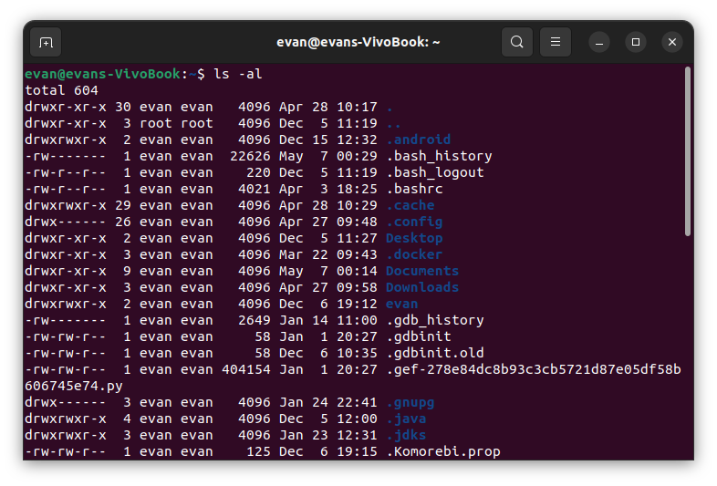

### File Management
#### Type of File
- `-`: ***Regular file***
- `b`: ***Block special file***. Block input/output device file such as a physical hard drive.
- `c`: ***Character special file***. Raw input/output device file such as a physical hard drive.
- `d`: ***Directory***
- `l`: ***Symbolic link file***
- `p`: ***pipe***
- `s`: ***Socket used for interprocess communication.***

#### Metacharacters
- `*`: match 0 or more characters
- `?`: matches with a single character.

#### Hidden Files

- An invisible file is one, the first character of which is the dot or the period character (**\.**).
- Unix programs (including the shell) use most of these files to store **configuration information**.
- **Single dot (.)** − This represents the current directory.
- **Double dot (..)** − This represents the parent directory.
- **.profile** − The Bourne shell ( sh) initialization script

#### Creating File
- `vi filename`: creat or edit file
- Press the key `esc` to come out of the edit mode.
- Press two keys `Shift` + `ZZ` together to come out of the file completely.

#### Manipulate File
- `cat`: see the content of a file
  - option `-b`:display the line numbers  
- `wc`: Counting Words in a File
- `cp`: Copying Files
- `mv`: Renaming Files
- `rm`: rm filename

#### Standard Unix Streams
every Unix program has three streams (files) opened for it when it starts up
- **stdin** − This is referred to as the standard input and the associated file descriptor is 0. This is also represented as STDIN. The Unix program will read the default input from STDIN.
- **stdout** − This is referred to as the standard output and the associated file descriptor is 1. This is also represented as STDOUT. The Unix program will write the default output at STDOUT.
- **stderr** − This is referred to as the standard error and the associated file descriptor is 2. This is also represented as STDERR. The Unix program will write all the error messages at STDERR.