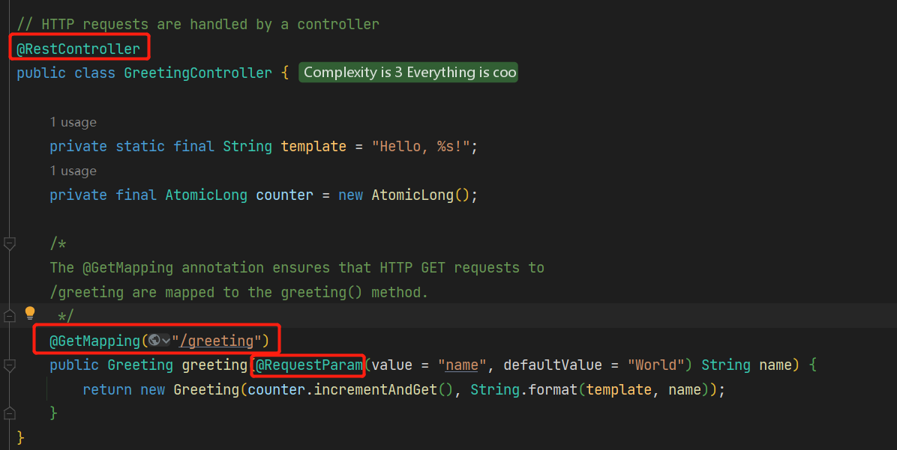

### RESTful Web Service
- `@RestController` :  HTTP requests are handled by a controller.
- `@GetMapping` : ensures that HTTP ***GET*** requests to specified method.
- `@PostMapping` : for POST.
- `@RequestMapping` : == `@RequestMapping(method=GET)`
- `@RequestParam` : binds the value of the query string parameter 

---
